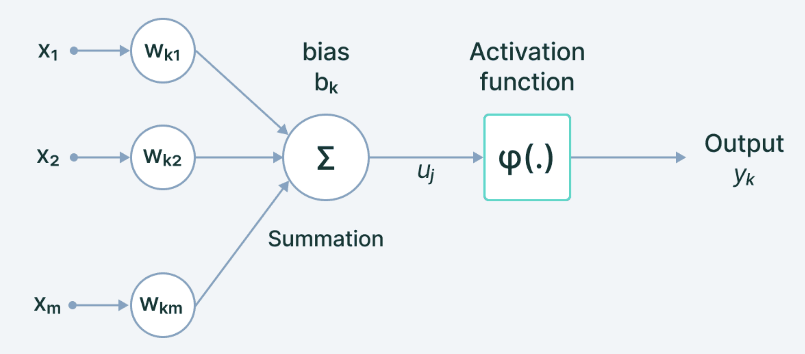
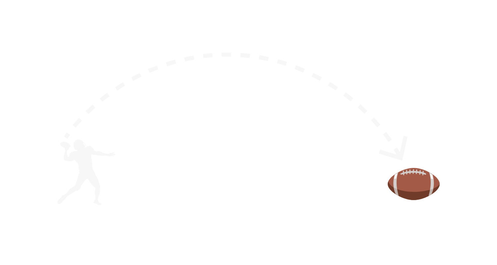
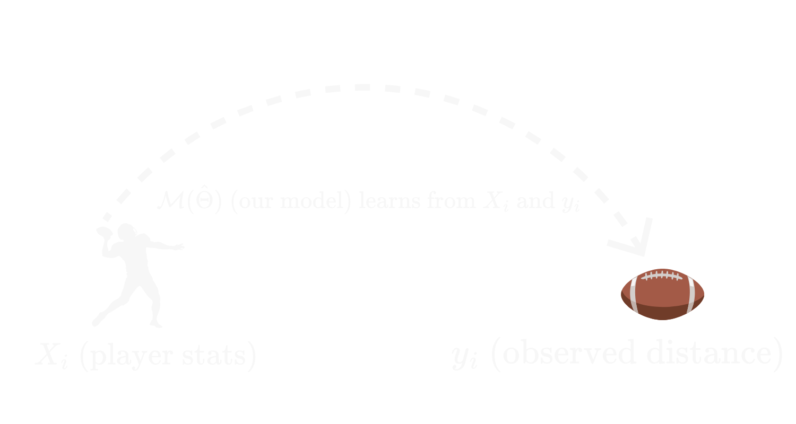
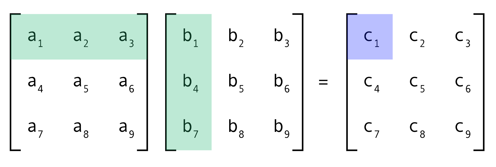

# Neural Networks for Quant Finance — Diagrams

> **Category:** Reference Images
> **Companion notebook:** `nn_for_quant/nn_quant.md`

## Description

Reference diagrams used inside `nn_quant.md` to explain neural-network concepts
in a quant-finance context. They cover network topology, the train/val/test
split, and analogy diagrams (football, market-maker) used to motivate ideas.

## When these images are useful

- Illustrating a fully-connected feed-forward network
- Explaining the standard train/validation/test split visually
- Concrete-analogy diagrams (football, MM) that ground abstract ML ideas

## Files

| File | What it shows |
| --- | --- |
| `nn.png` | Generic feed-forward neural-network topology (inputs → hidden layers → output) |
| `trainvaltest.PNG` | Train / validation / test split diagram |
| `football.png` | Analogy diagram (football example) used to motivate model design |
| `football_2.png` | Follow-up variant of the football analogy diagram |
| `mm.png` | Market-maker analogy diagram used to motivate the ML setup |

## Inline previews

