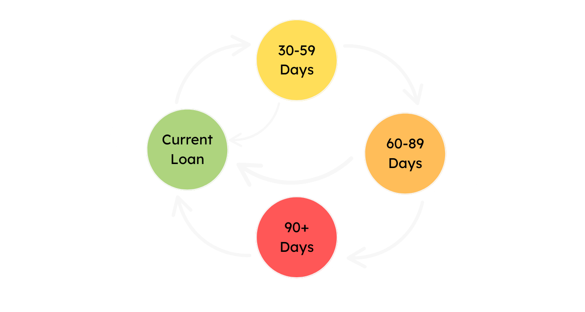
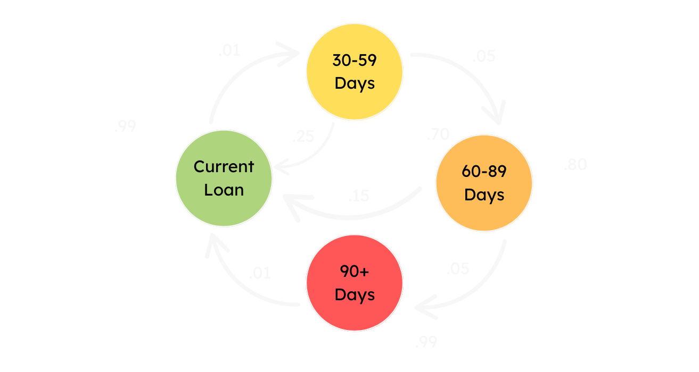

# Standalone Diagrams — Markov Chain Visuals

> **Category:** Reference Images

## Description

Two hand-drawn / rendered Markov-chain state diagrams referenced by the
`markov_chains.md` and `mp.md` notebooks. They illustrate state-transition
graphs that complement the algebraic transition-matrix work in those notebooks.

## When these images are useful

- Embedding a clean state-diagram into slides or write-ups about Markov chains
- Visually explaining the difference between communicating and non-communicating states
- Supplementing the algebraic treatment in `markov_chains.md` / `mp.md` with a picture

## Files

| File | Notes |
| --- | --- |
| `chain_11.png` | Markov-chain state-transition diagram, variant 1 |
| `chain_22.png` | Markov-chain state-transition diagram, variant 2 |

## Inline previews

